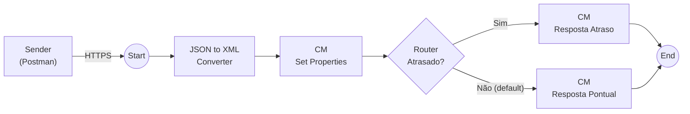

# 01 · iFlow HTTPS (request/reply)

**Objetivo:** criar o iFlow `Chegada_Trem_HTTPS`, que recebe a chegada do trem por HTTPS, classifica como ATRASADO ou NO_HORARIO e **devolve a resposta para quem chamou**.

| Nesta pasta | Para quê |
|---|---|
| `README.md` | Passo a passo desta etapa |
| [export/](export/) | `.zip` do iFlow pronto, para importar se você travar |

## Desenho do iFlow



## Passo a passo

### 1. Criar o package e o iFlow

1. No Integration Suite, abra **Design → Integrations and APIs**.
2. Clique em **Create** e crie o package:

   | Campo | Valor |
   |---|---|
   | Name | `MRS_<INICIAIS>` |

3. Clique em **Save**.
4. Na aba **Artifacts**, clique em **Add → Integration Flow**:

   | Campo | Valor |
   |---|---|
   | Name | `Chegada_Trem_HTTPS` |

5. Clique em **Add and Open in Editor** e depois em **Edit**.

### 2. Configurar o Sender HTTPS

1. Ligue o participante **Sender** ao **Start** e escolha o adapter **HTTPS**.
2. Configure:

   | Aba | Campo | Valor |
   |---|---|---|
   | Connection | Address | `/mrs/<INICIAIS>/chegada` |
   | Connection | Authorization | `User Role` |
   | Connection | User Role | `ESBMessaging.send` |
   | Connection | CSRF Protected | **desmarcado** |

> [!WARNING]
> Com **CSRF Protected** marcado, o Postman recebe **403 Forbidden**. Deixe desmarcado.

### 3. JSON to XML Converter

1. Depois do **Start**, adicione **Converter → JSON to XML Converter**.
2. Configure:

   | Campo | Valor |
   |---|---|
   | Use Namespace Mapping | **desmarcado** |
   | Add XML Root Element | **marcado** |
   | Name | `Evento` |

O JSON de entrada vira este XML:

```xml
<Evento>
  <trem>1234</trem>
  <patio>Juiz de Fora</patio>
  <previsto>08:00</previsto>
  <chegada>08:47</chegada>
  <status>ATRASADO</status>
</Evento>
```

### 4. CM Set Properties

1. Depois do converter, adicione um **Content Modifier** e renomeie para `Set Properties`.
2. Na aba **Exchange Property**, clique em **Add** cinco vezes e preencha:

   | Action | Name | Source Type | Source Value | Data Type |
   |---|---|---|---|---|
   | Create | `trem` | XPath | `/Evento/trem` | `java.lang.String` |
   | Create | `patio` | XPath | `/Evento/patio` | `java.lang.String` |
   | Create | `previsto` | XPath | `/Evento/previsto` | `java.lang.String` |
   | Create | `chegada` | XPath | `/Evento/chegada` | `java.lang.String` |
   | Create | `status` | XPath | `/Evento/status` | `java.lang.String` |

> [!NOTE]
> **Property × header:** a *property* fica só dentro do iFlow, como uma variável interna; o *header* viaja junto com a mensagem até o destino.

### 5. Router "Atrasado?"

1. Depois do **Set Properties**, adicione **Routing → Router** e renomeie para `Atrasado?`.
2. Crie duas rotas saindo do Router e configure na aba **Processing**:

   | Rota | Expression Type | Condition | Default Route |
   |---|---|---|---|
   | `Sim` | Non-XML | `${property.status} = 'ATRASADO'` | não |
   | `Não` | | | **sim** |

Condição para copiar:

```text
${property.status} = 'ATRASADO'
```

### 6. CMs de resposta

Crie um **Content Modifier** em cada rota e ligue os dois ao **End**.

**Aba Message Header** (nos dois CMs):

| Action | Name | Source Type | Source Value |
|---|---|---|---|
| Create | `Content-Type` | Constant | `application/json` |
| Create | `X-MRS-Classificacao` | Constant | `ATRASADO` no CM Resposta Atraso · `NO_HORARIO` no CM Resposta Pontual |

**Aba Message Body:** Type `Expression`. Cole o conteúdo do arquivo correspondente:

| CM | Rota | Body |
|---|---|---|
| `Resposta Atraso` | Sim | [payloads/resposta-https/resposta-atraso.json](../payloads/resposta-https/resposta-atraso.json) |
| `Resposta Pontual` | Não | [payloads/resposta-https/resposta-pontual.json](../payloads/resposta-https/resposta-pontual.json) |

<details>
<summary>Ver os dois bodies aqui</summary>

**Resposta Atraso**

```json
{
  "classificacao": "ATRASADO",
  "mensagem": "Alerta: trem ${property.trem} chegou em ${property.patio} às ${property.chegada}. Previsto: ${property.previsto}.",
  "acao": "Notificar cliente e planejamento"
}
```

**Resposta Pontual**

```json
{
  "classificacao": "NO_HORARIO",
  "mensagem": "Trem ${property.trem} chegou em ${property.patio} às ${property.chegada}, dentro do previsto.",
  "acao": "Nenhuma"
}
```

</details>

### 7. Deploy e endpoint

1. Clique em **Save** e depois em **Deploy**.
2. Abra **Monitor → Integrations and APIs → Manage Integration Content**.
3. Espere o status do `Chegada_Trem_HTTPS` ficar **Started**.
4. Clique no iFlow e copie o **Endpoint** da aba **Endpoints**. Ele termina com:

   ```text
   /http/mrs/<INICIAIS>/chegada
   ```

Guarde esse endpoint: ele é usado na próxima etapa, [02-postman](../02-postman/).

## Se travar

1. Baixe o `.zip` da pasta [export/](export/) (o instrutor publica o arquivo lá).
2. No package `MRS_<INICIAIS>`, clique em **Edit → Add → Integration Flow → Upload** e selecione o `.zip`.
3. Abra o iFlow, troque `<INICIAIS>` no **Address** do Sender HTTPS pelas suas iniciais e faça o **Deploy**.
