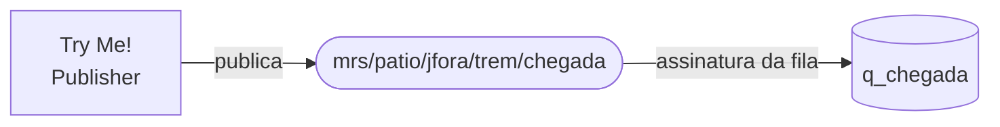

# 03 · Solace (Advanced Event Mesh)

**Objetivo:** criar o broker, a fila `q_chegada` assinando o tópico de chegada, e confirmar no Try Me! que a mensagem fica guardada na fila.



## 1. Criar o serviço no Solace Cloud

1. Entre no **Solace Cloud** com sua conta trial.
2. Abra **Cluster Manager** e clique em **Create Service**.
3. Escolha o plano gratuito/trial disponível, uma região de nuvem e dê o nome `mrs-<INICIAIS>`.
4. Clique em **Create Service** e espere o status ficar **Active** (alguns minutos).

## 2. Pegar os dados de conexão

1. Abra o serviço e vá na aba **Connect**.
2. Expanda a seção de conexão (por protocolo) e anote:

   | Dado | Onde achar | Exemplo de formato |
   |---|---|---|
   | Host | Endereço do **AMQP** seguro (`amqps://...:5671`), **só o host** | `<SEU_HOST_SOLACE>` |
   | Username | Campo **Username** | `solace-cloud-client` |
   | Password | Campo **Password** | `<SENHA_SOLACE>` |
   | Message VPN | Campo **Message VPN** | `<MESSAGE_VPN>` |

> [!WARNING]
> O endereço `wss://...:443` é do **Try Me!** e do navegador (WebSocket).
> Para o AMQP do Integration Suite, use **só o host**, sem `amqps://`, sem `wss://` e sem porta. A porta é configurada à parte: **5671**.

## 3. Criar a fila `q_chegada`

1. No serviço, clique em **Open Broker Manager**.
2. Vá em **Queues → + Queue**.
3. Nome: `q_chegada` → **Create**.
4. Configure e clique em **Apply**:

   | Campo | Valor |
   |---|---|
   | Access Type | `Exclusive` |
   | Non-Owner Permission | `Consume` |

5. Abra a fila → aba **Subscriptions** → **+ Subscription**, cole o tópico e clique em **Create**:

   ```text
   mrs/patio/jfora/trem/chegada
   ```

## 4. Testar no Try Me!

1. No Broker Manager, abra a aba **Try Me!**.
2. No lado **Publisher**, clique em **Connect** (os dados já vêm preenchidos).
3. Configure a publicação:

   | Campo | Valor |
   |---|---|
   | Topic | `mrs/patio/jfora/trem/chegada` |
   | Delivery Mode | `Persistent` |
   | Message Content | conteúdo de [trem-atrasado.json](../payloads/entrada/trem-atrasado.json) |

   ```json
   {
     "trem": "1234",
     "patio": "Juiz de Fora",
     "previsto": "08:00",
     "chegada": "08:47",
     "status": "ATRASADO"
   }
   ```

4. Clique em **Publish**.
5. Volte em **Queues** e confira: a coluna **Messages Queued** de `q_chegada` aumentou em 1.

> [!NOTE]
> A mensagem fica na fila até alguém consumir. Na etapa 04, quem consome é o iFlow.

## Tópico × fila

> [!IMPORTANT]
> **Tópico não se cria.** Ele passa a existir quando alguém publica nele: é só um endereço.
> **Fila se cria**, porque é armazenamento: ela guarda as mensagens dos tópicos que assina até alguém consumir.

## Wildcards

| Significado | Solace | MQTT | Exemplo Solace | Exemplo MQTT |
|---|---|---|---|---|
| Exatamente **um** nível | `*` | `+` | `mrs/patio/*/trem/chegada` | `mrs/patio/+/trem/chegada` |
| **Um ou mais** níveis (só no fim) | `>` | `#` | `mrs/alerta/>` | `mrs/alerta/#` |

Os dois exemplos de "um nível" pegam a chegada de **qualquer pátio** (`jfora`, `vredonda`, ...). Os de "vários níveis" pegam **qualquer alerta**.

## Próximo passo

Siga para [04-iflow-evento](../04-iflow-evento/).
