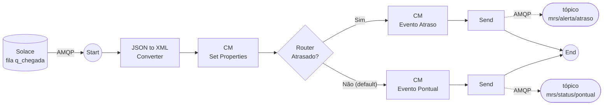

# 04 · iFlow por evento

**Objetivo:** a **mesma lógica** do iFlow HTTPS, agora acionada por evento. O iFlow `Chegada_Trem_Evento` consome a fila `q_chegada` via AMQP e publica o resultado como um **novo evento** em outro tópico.

| Nesta pasta | Para quê |
|---|---|
| `README.md` | Passo a passo desta etapa |
| [export/](export/) | `.zip` do iFlow pronto, para importar se você travar |

## Desenho do iFlow



## Passo a passo

### 1. Criar a credencial do Solace

1. Abra **Monitor → Integrations and APIs → Security Material**.
2. Clique em **Create → User Credentials** e preencha:

   | Campo | Valor |
   |---|---|
   | Name | `SOLACE_AMQP` |
   | Type | `User Credentials` |
   | User | `solace-cloud-client` |
   | Password | password do Solace (aba **Connect**, etapa 03) |

3. Clique em **Deploy**.

### 2. Copiar o iFlow HTTPS

1. Em **Design**, abra o package `MRS_<INICIAIS>`.
2. No `Chegada_Trem_HTTPS`, clique em **Actions (⋯) → Copy**.
3. Nome: `Chegada_Trem_Evento` → **Copy**.
4. Abra a cópia e clique em **Edit**.

### 3. Trocar o sender por AMQP

1. Apague a ligação HTTPS entre o **Sender** e o **Start**.
2. Ligue o **Sender** ao **Start** de novo e escolha **AMQP → TCP**.
3. Configure:

   | Aba | Campo | Valor |
   |---|---|---|
   | Connection | Host | `<SEU_HOST_SOLACE>` (sem `wss://`, sem `amqps://`, sem porta) |
   | Connection | Port | `5671` |
   | Connection | Proxy Type | `Internet` |
   | Connection | Connect with TLS | **marcado** |
   | Connection | Authentication | `SASL` |
   | Connection | Credential Name | `SOLACE_AMQP` |
   | Connection / Processing | Disable Reply-To | **marcado** |
   | Processing | Queue Name | `q_chegada` |

> [!WARNING]
> Em **Authentication**, use **SASL**. Não use *Client Certificate*: o Solace trial autentica por usuário e senha.

### 4. Adicionar os Sends e os Receivers

Faça isto nas **duas rotas**:

1. Apague a ligação entre o CM de resposta e o **End**.
2. Depois do CM, adicione **Call → External Call → Send** e ligue o **Send** ao **End**.
3. Adicione um participante **Receiver** e ligue o **Send** a ele com **AMQP → TCP**.
4. Na aba **Connection**, use **a mesma conexão do sender**: Host, Port `5671`, Proxy `Internet`, TLS marcado, SASL, `SOLACE_AMQP`.
5. Na aba **Processing**:

   | Rota | Destination Type | Destination Name |
   |---|---|---|
   | Sim | `Topic` | `mrs/alerta/atraso` |
   | Não | `Topic` | `mrs/status/pontual` |

> [!NOTE]
> Use o nome do tópico **sem** o prefixo `topic://`. Já validado: com o Destination Type `Topic`, o nome puro funciona.

### 5. Trocar os bodies dos CMs

1. Renomeie os CMs para `Evento Atraso` e `Evento Pontual`.
2. Na aba **Message Body** (Type `Expression`), substitua o body pelo conteúdo de:

   | CM | Body |
   |---|---|
   | `Evento Atraso` | [payloads/evento-saida/evento-trem-atrasado.json](../payloads/evento-saida/evento-trem-atrasado.json) |
   | `Evento Pontual` | [payloads/evento-saida/evento-trem-no-horario.json](../payloads/evento-saida/evento-trem-no-horario.json) |

<details>
<summary>Ver os dois bodies aqui</summary>

**Evento Atraso**

```json
{
  "evento": "TremAtrasado",
  "trem": "${property.trem}",
  "patio": "${property.patio}",
  "previsto": "${property.previsto}",
  "chegada": "${property.chegada}",
  "mensagem": "Trem ${property.trem} chegou em ${property.patio} às ${property.chegada}, com atraso. Previsto: ${property.previsto}."
}
```

**Evento Pontual**

```json
{
  "evento": "TremNoHorario",
  "trem": "${property.trem}",
  "patio": "${property.patio}",
  "previsto": "${property.previsto}",
  "chegada": "${property.chegada}",
  "mensagem": "Trem ${property.trem} chegou em ${property.patio} às ${property.chegada}, dentro do previsto."
}
```

</details>

3. Clique em **Save** e depois em **Deploy**.
4. Em **Manage Integration Content**, confira se o `Chegada_Trem_Evento` está **Started**.

> [!TIP]
> Mensagens que você publicou na etapa 03 ainda estão na fila. Assim que o iFlow sobe, ele consome essas mensagens.

## Por que não tem resposta?

> [!IMPORTANT]
> No evento, **ninguém fica esperando a resposta**: quem publicou a chegada já seguiu em frente.
> O resultado vira um **novo evento**, publicado em outro tópico para quem tiver interesse.
> Por isso usamos o step **Send** (publicar sem esperar retorno) e o **Disable Reply-To** no sender.

## Cuidado com loop

> [!WARNING]
> Os tópicos de saída (`mrs/alerta/atraso`, `mrs/status/pontual`) **não podem casar com a assinatura da fila** (`mrs/patio/jfora/trem/chegada`).
> Se casassem, o iFlow publicaria um evento que voltaria para a própria fila, e ele consumiria de novo, sem parar.
> Exemplo do que **não** fazer: assinar a fila com `mrs/>`.

## Se travar

1. Baixe o `.zip` da pasta [export/](export/) (o instrutor publica o arquivo lá).
2. No package `MRS_<INICIAIS>`, clique em **Edit → Add → Integration Flow → Upload** e selecione o `.zip`.
3. Abra o iFlow e confira o **Host** (`<SEU_HOST_SOLACE>`) no sender e nos dois receivers AMQP.
4. Confira se a credencial `SOLACE_AMQP` existe e faça o **Deploy**.

## Próximo passo

Siga para [05-ponta-a-ponta](../05-ponta-a-ponta/).
