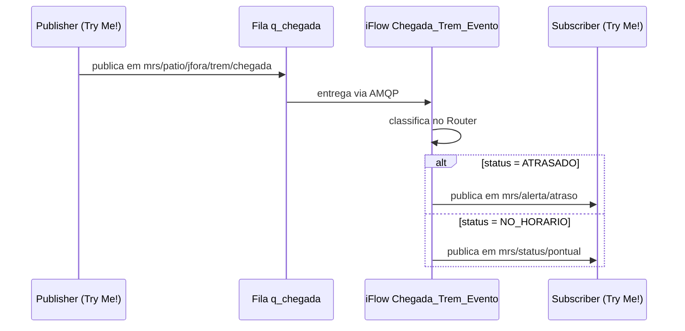

# 05 · Teste ponta a ponta

**Objetivo:** publicar a chegada do trem no Solace e ver o evento de saída chegar ao subscriber, passando pelo iFlow `Chegada_Trem_Evento`.



## Roteiro de teste

### 1. Preparar o subscriber

1. No Broker Manager, abra o **Try Me!**.
2. No lado **Subscriber**, clique em **Connect**.
3. Em **Topic Subscriber**, adicione as duas assinaturas:

   ```text
   mrs/alerta/>
   ```

   ```text
   mrs/status/>
   ```

4. Clique em **Subscribe**.

### 2. Publicar o trem atrasado

1. No lado **Publisher**, configure:

   | Campo | Valor |
   |---|---|
   | Topic | `mrs/patio/jfora/trem/chegada` |
   | Delivery Mode | `Persistent` |
   | Message Content | [trem-atrasado.json](../payloads/entrada/trem-atrasado.json) |

   ```json
   {
     "trem": "1234",
     "patio": "Juiz de Fora",
     "previsto": "08:00",
     "chegada": "08:47",
     "status": "ATRASADO"
   }
   ```

2. Clique em **Publish**.
3. No **Subscriber**, confira: chegou uma mensagem no tópico **`mrs/alerta/atraso`** com `"evento": "TremAtrasado"`.

### 3. Publicar o trem no horário

1. Troque o **Message Content** por [trem-no-horario.json](../payloads/entrada/trem-no-horario.json):

   ```json
   {
     "trem": "5678",
     "patio": "Juiz de Fora",
     "previsto": "09:00",
     "chegada": "08:58",
     "status": "NO_HORARIO"
   }
   ```

2. Clique em **Publish**.
3. No **Subscriber**, confira: chegou uma mensagem no tópico **`mrs/status/pontual`** com `"evento": "TremNoHorario"`.

### 4. Conferir no Integration Suite e no Solace

| Onde | O que conferir |
|---|---|
| Integration Suite → **Monitor Message Processing** | Uma mensagem **Completed** para cada publicação |
| Broker Manager → **Queues → q_chegada** | **Messages Queued** = 0 (o iFlow consumiu tudo) |
| Broker Manager → **Queues → q_chegada** | **Consumers** = 1 (o iFlow está conectado) |

Deu erro? Veja [referencia/troubleshooting.md](../referencia/troubleshooting.md).

## Checklist final

- [ ] `Chegada_Trem_HTTPS` responde 200 no Postman com `X-MRS-Classificacao`
- [ ] Mensagens do Postman aparecem como **Completed** no Monitor
- [ ] Fila `q_chegada` criada com a assinatura `mrs/patio/jfora/trem/chegada`
- [ ] Credencial `SOLACE_AMQP` criada e deployada
- [ ] `Chegada_Trem_Evento` em **Started**, com **Consumers = 1** na fila
- [ ] Trem atrasado chega no subscriber em `mrs/alerta/atraso`
- [ ] Trem no horário chega no subscriber em `mrs/status/pontual`
- [ ] **Messages Queued** de `q_chegada` voltou a 0

Terminou antes? Veja os [desafios](../extras/desafios.md).
