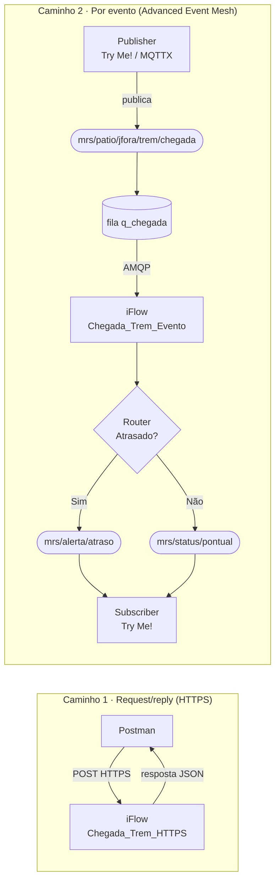

# MRS · Integration Suite + Advanced Event Mesh

Material de apoio do treinamento hands-on de **SAP Integration Suite** e **SAP Advanced Event Mesh (Solace)** para a MRS Logística.

## Cenário

O **trem 1234** chega ao **pátio de Juiz de Fora às 08:47**, previsto para **08:00**. Essa chegada precisa ser comunicada a várias áreas.

O iFlow lê o evento de chegada, classifica como **ATRASADO** ou **NO_HORARIO** e reage de forma diferente em cada caso.

## Arquitetura

## Roteiro do hands-on

Antes de começar, confira os [pré-requisitos](00-pre-requisitos/).

| Etapa | O que você faz | Pasta |
|---|---|---|
| 1 | Cria o iFlow `Chegada_Trem_HTTPS` (request/reply) | [01-iflow-https](01-iflow-https/) |
| 2 | Chama o iFlow pelo Postman com OAuth 2.0 | [02-postman](02-postman/) |
| 3 | Cria o serviço Solace, a fila `q_chegada` e testa no Try Me! | [03-solace](03-solace/) |
| 4 | Cria o iFlow `Chegada_Trem_Evento` (acionado por evento) | [04-iflow-evento](04-iflow-evento/) |
| 5 | Testa o fluxo completo, do publisher ao subscriber | [05-ponta-a-ponta](05-ponta-a-ponta/) |

## Request/reply × evento

- **Request/reply:** o Postman chama o iFlow e fica esperando; a resposta volta para quem perguntou.
- **Evento:** quem publica a chegada não espera ninguém; o broker entrega para quem tiver interesse, e o resultado vira um novo evento.
- Por isso existem **duas versões do iFlow com a mesma lógica**: só muda a forma de entrada e de saída, e dá para comparar os dois estilos lado a lado.

## Onde encontrar o resto

| Pasta | Conteúdo |
|---|---|
| [payloads](payloads/) | JSONs de entrada, respostas HTTPS e eventos de saída, prontos para copiar |
| [referencia](referencia/) | Glossário, convenção de nomes e troubleshooting |
| [extras](extras/) | Roteiro da demo do instrutor e desafios opcionais |

> [!IMPORTANT]
> Nunca faça commit de credenciais. Salve seus arquivos preenchidos como `*.local.json` ou `.env`; o `.gitignore` já ignora esses arquivos.
